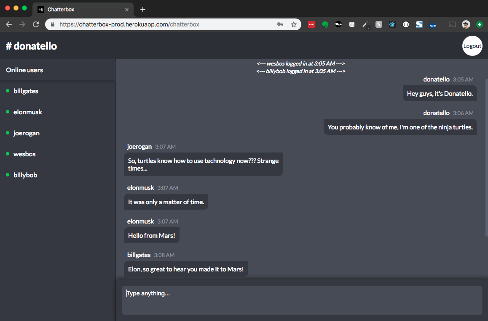

# Chatterbox

Chatterbox is a MERN stack chat application that utilizes SocketIO for real-time, bidirectional, event-based communication.



Within this project I was able to delve into numerous concepts surrounding REST API's, MongoDB, user sessions, user authentication, form validation, password hashing, cors and a few other things I'm sure I'm forgetting!

I decided to bootstrap the front-end with Create React App rather than using a traditional MVC design pattern because, frankly, I enjoy writing React. Though, I have worked with Pug previously to render view files.

## Instructions to play

- Go to <a href="https://chatterbox-prod.herokuapp.com/" target=_blank>Chatterbox</a>
- Sign up for an acccount or sign in using pseudo accounts listed below
  - Joe Rogan
    - Email: joe@gmail.com
    - Password: testing
  - Elon Musk
    - Email: elon@gmail.com
    - Password: testing
  - Bill Gates
    - Email: bill@gmail.com
    - Password: testing
- Open up an incognito window and sign in with a separate account
- Start chatting!

## Install

Clone this respository:

```bash
git clone https://github.com/matthewoctober/chatterbox.git
```

(If you're not a fan of splitting terminal windows, feel free to _npm install <a href="https://www.npmjs.com/package/concurrently" target="_blank">concurrently</a>_ and write your own npm script to run both servers simultaneously. Otherwise, split your terminal windows and proceed.)

(Server terminal) Install server project dependencies:

```bash
cd chatterbox
npm install
```

(Client terminal) Install client project dependencies:

```bash
cd chatterbox && cd client
npm install
```

Create a environment variables file in the root directory

```bash
touch variables.env
```

Create the following variables in your variables.env file:

- NODE_ENV=development
- DATABASE=_replace-with-mlab-driver_
- SECRET= _replace-with-unique-secret_

Visit <a href="https://mlab.com/" target="_blank">https://mlab.com</a> to create a free database and copy & paste your driver as the value for your DATABASE variable.

(Client terminal) Run development server:

```bash
npm start
```

(Server terminal) Run development express server:

```bash
npm run dev
```

And there you have it, your own MERN stack application to tinker with!

Happy hacking!
